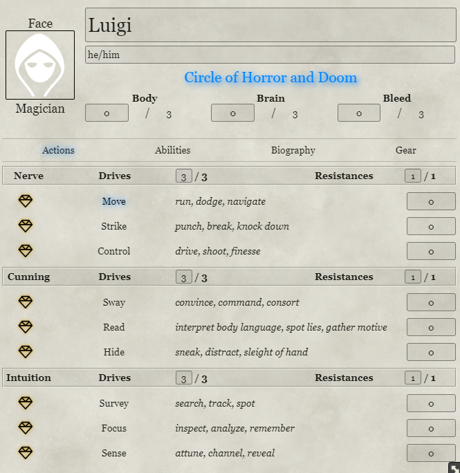
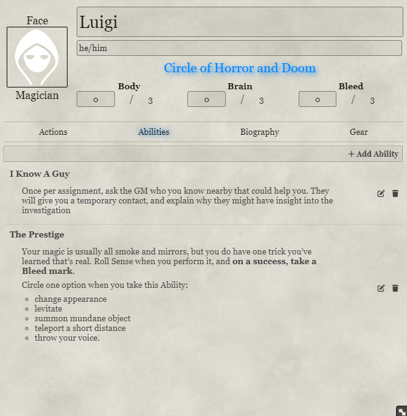
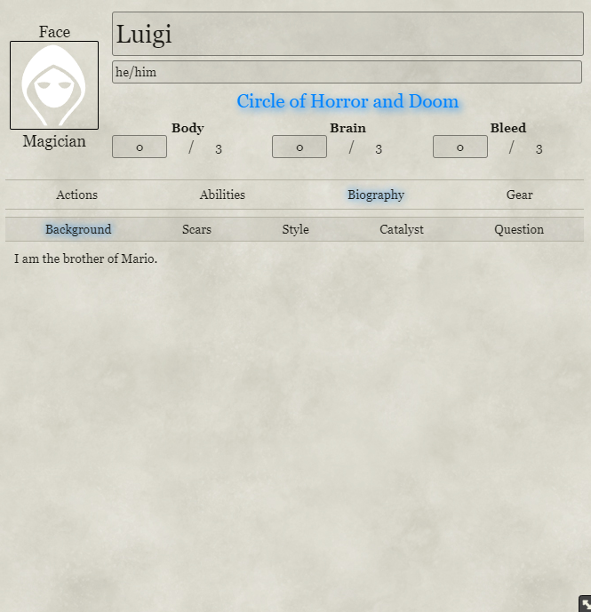
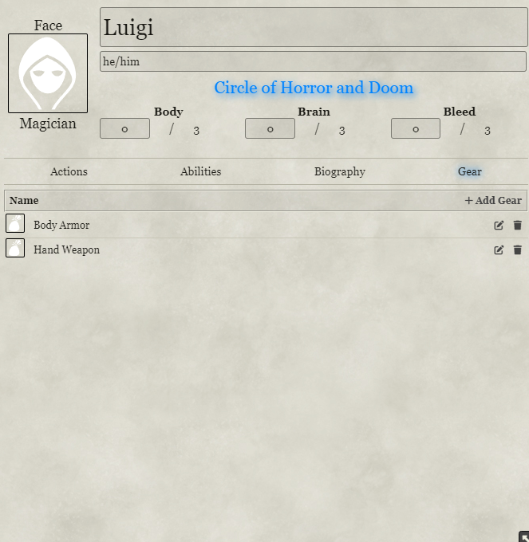
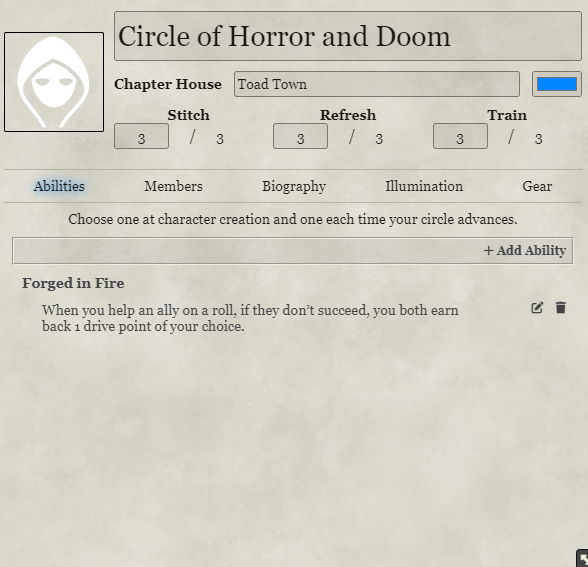
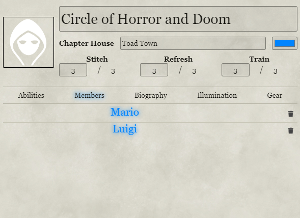
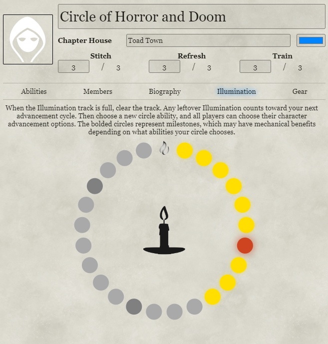
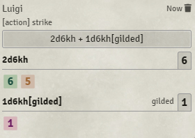
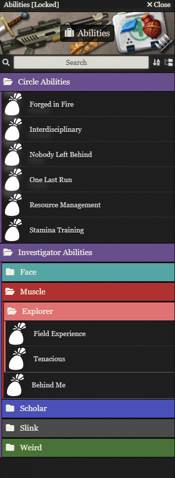

# Candela Obscura for Foundry VTT

This system is an unofficial, basic implementation of the Candela Obscura Core Rulebook by Darrington Press.

## Usage

There is an ingame compendium called "System Manual", that has a basic tutorial on how to create your characters and a circle.

## Supported Languages

- English
- German
- Spanish

## Contributing

- If you have any issues with the system, please open a issue at [Github](https://github.com/ceriath/candela-fvtt).
- If you have any improvements (including translations), feel free to open a pull request, i am happy to review and merge them!

## Credits

- This system and content is based on the [Candela Obscura Quickstart Guide](https://darringtonpress.com/candela/) written by Spenser Starke and Rowan Hall at Darrington Press and the [Candela Obscura Core Rulebook](https://darringtonpress.com/candela/) by Darrington Press under the [Darrington Press Community Gaming License](https://darringtonpress.com/license/). I don't have, nor do i claim, any rights regarding that content.

- The code has been based on the [Boilerplate System](https://gitlab.com/asacolips-projects/foundry-mods/boilerplate) by [Matt Smith (Asacolips)](https://github.com/asacolips) 

## Screenshots

### Character Sheet

### Circle Sheet

### Rolls

### Compendia

